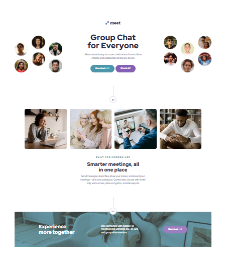

# Frontend Mentor - Meet landing page 

This is a solution to the [Meet landing page component challenge on Frontend Mentor](https://www.frontendmentor.io/challenges/meet-landing-page-rbTDS6OUR). Frontend Mentor challenges help you improve your coding skills by building realistic projects.

## Table of contents

- [Overview](#overview)
  - [Screenshot](#screenshot)
  - [Links](#links)
- [My process](#my-process)
  - [Built with](#built-with)
  - [What I learned](#what-i-learned)
  - [Continued development](#continued-development)
  - [Useful resources](#useful-resources)
- [Author](#author)
- [Acknowledgments](#acknowledgments)

## Overview

### Screenshot

### Links

- Solution URL: [Add solution URL here](https://github.com/mehdias63/Meet-Landing-Page)
- Live Site URL: [Add live site URL here](https://meet-landing-page-iota-nine.vercel.app)

## My process

### Built with

- [React](https://reactjs.org/) - JS library
- [Tailwind](https://tailwindcss.com/) - For styles
